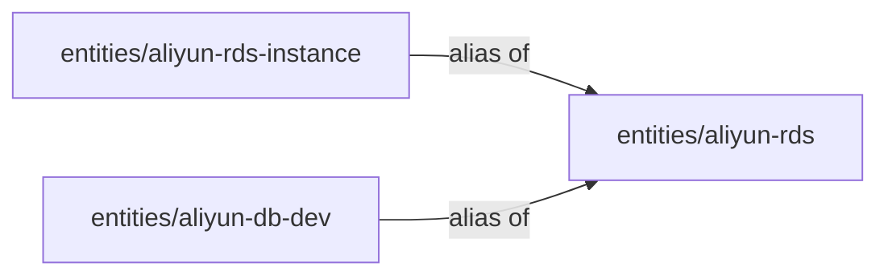
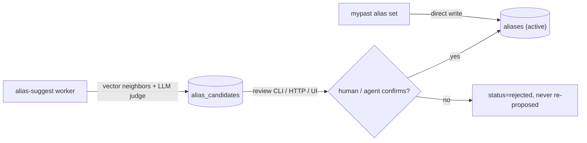

# Aliases — declaring two memory slugs are the same entity

> Status: implemented (human-authored writes + machine propose-and-confirm). A
> durable statement that one memory URI is the same real-world entity as
> another, so the redundant slug folds into the canonical one at recall time and
> never shows up as a separate result again. Live aliases are always
> human-confirmed; the alias-suggest worker only proposes candidates.
>
> Sibling mechanism to [`corrections.md`](./corrections.md): same append-first,
> outside-the-pyramid discipline, different job. Corrections patch *content*;
> aliases resolve *identity*.

## Problem

T3 roll-up routes facts into memory slugs (`mypast://entities/<slug>`) per
category. The same real entity can land under different slugs across sessions —
slug drift — e.g. `entities/aliyun-rds` and `entities/aliyun-rds-instance`.
Nothing tells the system they are one thing, so both surface independently in
`search`, dilute each other's recall, and confuse the agent.

We want to state the identity **once** and have every future recall treat the
two as one, without hand-editing derived rows (the next T3 rollup would
overwrite the edit — the churn the append-first design avoids).

## Why not `memories.cname`?

An earlier attempt added `cname`/`cname_desc` columns onto `memories`. That
couples identity to the distillation tier: T3 **inserts new rows** and supersedes
old ones (it never mutates `body`), so any `cname` written on a row is orphaned
on the next distill cycle unless the worker copies it forward. Identity then
depends on the worker remembering to preserve it.

Aliases instead live in their **own append-only table**, keyed by logical memory
URI (stable across re-distillation). The relationship survives every rollup
because it is not derived data. This is the same escape hatch corrections use,
and the spot `corrections.md` explicitly reserved for "entity resolution as its
own thing".

## Data model — `aliases`

A sibling table to `memories`, append-only and URI-addressable as
`mypast://aliases/<uuid>`.

| Column | Notes |
|--------|-------|
| `id` | uuid, append-only; never `UPDATE` except to set `superseded_at` |
| `uri` | `mypast://aliases/<uuid>` — identity of the *relationship*, the handle for `rm` |
| `alias_uri` | the redundant memory URI (the one that should disappear from results) |
| `canonical_uri` | the authoritative memory URI it folds into |
| `note` | optional human rationale |
| `superseded_at` | set when this specific alias is retracted; NULL = active |
| `created_at` / `updated_at` | |

Both `alias_uri` and `canonical_uri` must be **mergeable memory** URIs —
`preferences` or `entities` — and the **same category**. The other tiers are
excluded by construction: `profile` is a singleton with no slug, `events` are
immutable and never re-distilled (so a merge could not take effect), and
sessions/scenes/corrections/aliases are not memories at all.

## Topology — a flat star, depth 1

An alias points **directly** to a canonical. A canonical may **not** itself be an
active alias of something else. There are no chains.



Invariants enforced at write time (`alias.Service.Create`):

- `alias_uri != canonical_uri` (no self-alias; also a CHECK constraint).
- both sides are the **same category** (`entities`/`entities` or
  `preferences`/`preferences`) — T3 routes by `(category, slug)`, so a
  cross-category fold is incoherent.
- `alias_uri` is not already an active alias (unique partial index
  `idx_aliases_alias_uri_active`) — a URI can be an alias of at most one thing.
- `canonical_uri` is not itself an active alias — this is what forbids chains and
  makes resolution a single lookup with no cycle risk.

If you later discover the canonical `C` is itself a duplicate of `D`, you retract
the `* -> C` aliases and re-declare them against `D`. Two operations, but
unambiguous — there is never a chain to walk or a cycle to detect.

## Behavior at recall (the point of the feature)

`recall.ResolveAliases` runs after RRF fusion in `Search`:

1. Look up every result URI's active canonical (single batched query).
2. Rewrite each match URI to its canonical.
3. Merge matches that collapse onto the same canonical, keeping the higher rank.

So an aliased memory never surfaces under its redundant URI, and two slugs for
one entity fold into a single result. Corrections overlay then runs on the
canonical URIs as usual. Fusion keeps extra headroom before the `k` cut so that
folding does not under-fill the page.

The read-time fold is the **safety net** for the window between declaring an
alias and the next T3 rollup (and a no-op once the merge below has run, since the
alias slug's row is retired and no longer a search hit).

## Behavior at distillation — the merge (the point of the feature)

Read-time folding alone picks one of two already-incomplete bodies: when two
slugs describe *different aspects* of one entity, neither row is the whole
picture. The durable fix is to merge at the **bucket-routing** step of T3, where
the duplicate is actually born.

`groupAtomsIntoBuckets` (in [`internal/service/memory/group.go`](../internal/service/memory/group.go))
takes the active alias map (`alias.ActiveMap`). When an atom's routed URI
`mypast://<cat>/<slug>` is an active alias, its atoms are folded into the
**canonical** bucket. One `DistillMemory` call then sees the union of both
slugs' atoms and regenerates a single complete body. The canonical's
`source_scene_uris` naturally grows, so the existing provenance gate detects the
change and re-distills; no special gate logic is needed.

This delivers both goals at once:

1. **Completeness** — the canonical body becomes the union of all aspects.
2. **Distillation hint** — the alias is a standing routing rule: a fact that lands
   on the alias slug in a *future* session is pulled into the canonical at the
   next rollup, so the duplicate never respawns.

It mirrors how corrections do write-time injection. On `alias set` the handler:

- **wakes T3** for the sessions feeding both slugs (`EnqueueSessionsForMemoryTargets`)
  so the merge happens promptly, and
- **retires** the alias slug's standalone memory row (`SupersedeActiveMemory`) —
  its facts have moved to the canonical, so leaving it active would be a stale
  duplicate.

On `alias rm` the canonical is re-woken so it re-distills without the unfolded
atoms; the retired alias slug's own bucket is rebuilt on the same global cycle.

## Behavior at inspect

Because the alias slug's row is retired once folded, `cat`/`meta` on an alias URI
**redirect** to the canonical instead of erroring on the missing active row:

- `cat <alias-uri>`:
  ```
  This entity is an alias of mypast://entities/aliyun-rds.

  → ALIAS OF: mypast://entities/aliyun-rds
  (showing canonical below)

  <canonical body…>
  ```
- `cat <canonical-uri>` — prints the canonical body, then:
  ```
  --- aliases ---
  ← mypast://entities/aliyun-rds-instance (note if any)
  ```
- `meta <alias-uri>` includes `"alias_of": "<canonical>"`.
- `meta <canonical-uri>` includes `"aliases": ["<alias>", ...]`.

## Generation: human-authored or machine-proposed (both human-confirmed)

A live alias is **only ever written by human confirmation** — never by a
machine on its own. There are two paths to that confirmation:

1. **Direct** — the user (or the agent on the user's say-so) runs `mypast alias
   set`, the same trust model as corrections.
2. **Propose-and-confirm** — the **alias-suggest worker** proposes *candidates*
   into `alias_candidates`; a human/agent then confirms (which writes the live
   alias) or rejects.

This gate matters because a wrong alias is **destructive at read time** — it
hides a real entity behind another in every future search. Vector-similar is
not the same as same-entity: `aliyun-rds-dev` and `aliyun-rds-prod` sit close in
embedding space but must never be merged, so the machine only ever *suggests*.



### The alias-suggest worker

[`internal/service/alias/suggest.go`](../internal/service/alias/suggest.go).
Off by default (it makes recurring LLM judge calls). Each cycle, under the same
global advisory lock as T3:

1. Loads a bounded batch of active, **already-embedded** entity/preference
   memories (it reads the embeddings the embed worker wrote — it makes no
   embedding calls of its own).
2. For each, finds nearest same-category neighbors by cosine similarity above
   `min_similarity` (pgvector ANN, excluding self).
3. Dedups to unordered pairs and **skips** any pair that was already judged
   (present in `alias_candidates` in either direction) or whose either side is
   already in an active alias.
4. Asks the LLM judge ("same entity? which is canonical?") and records the
   verdict: `pending` when same (in the judge's chosen direction), `rejected`
   when different (sorted direction). Insert is `ON CONFLICT DO NOTHING`.

Cost is self-bounding: every judged pair leaves a row, so a pair is judged at
most once ever, and a rejected pair is never re-proposed.

Config (`[alias_suggest]` / `MYPAST_ALIAS_SUGGEST_*`):

| Key | Default | Meaning |
|-----|---------|---------|
| `enabled` | `false` | turn the worker on |
| `poll_interval` | `30m` | cycle cadence |
| `batch_memories` | `50` | seed memories scanned per cycle |
| `neighbors` | `5` | nearest neighbors considered per seed |
| `min_similarity` | `0.82` | cosine floor to surface a pair |

### Reviewing candidates

```
mypast alias candidates [--status=pending]   # list (pending|confirmed|rejected|all)
mypast alias confirm <candidate-id>          # promote to a live alias
mypast alias reject  <candidate-id>          # reject; never re-proposed
```

`confirm` runs the exact same post-write side-effects as `alias set` (wake T3,
supersede the alias slug's standalone row). It surfaces a conflict if the live
invariants fail (e.g. the canonical is itself an alias), leaving the candidate
pending. The web UI exposes the same review under Aliases → Suggestions.

## CLI surface

```
mypast alias set <alias-uri> <canonical-uri> ["note"]
mypast alias rm  <mypast://aliases/...>     # retract a specific alias
mypast alias ls  [<uri>]                    # list active aliases (either side)
mypast meta <uri>                           # also shows alias_of / aliases
```

Writing an alias is a privileged op, so (like corrections) the CLI is a pure API
client and the write path requires auth (`MYPAST_URL` + credentials).

## HTTP API

```
POST   /api/v1/aliases            { alias_uri, canonical_uri, note? }  -> 201 | 400 | 409
DELETE /api/v1/aliases?uri=...    retract by alias record URI          -> 200 | 400 | 404
GET    /api/v1/aliases?uri=...    list (filter by either side)         -> 200

GET    /api/v1/alias-candidates?status=   list candidates (default pending)   -> 200 | 400
POST   /api/v1/alias-candidates/confirm   { id }  promote to a live alias     -> 201 | 400 | 404 | 409
POST   /api/v1/alias-candidates/reject    { id }  reject; never re-proposed   -> 200 | 400 | 404
```

`409 Conflict` is returned when an invariant is violated (alias already aliased,
or canonical is itself an alias) — on both the direct write and on confirm.

## Known limitation — slug collision (deferred topic)

The merge trusts the slug as the entity's identity, because T3 routing already
does: a bucket is keyed only by `(category, slug)`. Two genuinely different
entities that get the **same** slug from T1 already merge today, alias or not —
the slug *is* the identity. An alias extends this by binding the alias-side slug
permanently into the canonical, so a *future*, unrelated entity that happens to
reuse the alias slug would be folded in too. The alias decision is human-vetted
once, but the routing rule then applies unsupervised to future atoms.

This is a property of the weak `(category, slug)` identity key, not of aliasing
per se. It is bounded in practice by specific slugs (the real fix — see the
slugging gap in [`project-review.md`](./project-review.md)), and by the fact that
the fold is observable (`cat` lists the canonical's alias sources) and reversible
(`alias rm`). Strengthening entity identity is tracked as a separate topic; the
current fold is the deliberately-mechanical choice, consistent with the rest of
T3.

## Scope (delivered)

- `aliases` + `alias_candidates` tables + migration (`00011`), with flat-star +
  same-category invariants.
- New `mypast://aliases/<uuid>` URI scope.
- Write path: service + HTTP handler + CLI + client (`set`/`rm`/`ls`).
- Read-time resolution wired into `search` (fold + dedup) as the safety net.
- **T3 merge**: alias-aware bucket routing, write-time wake, and retirement of the
  folded slug's row.
- Inspect `cat`/`meta` redirect for alias URIs; alias annotations on the canonical.
- **Alias-suggest worker** (vector-neighbor + LLM judge → candidates) plus the
  review/confirm surface across CLI (`candidates`/`confirm`/`reject`), HTTP
  (`/api/v1/alias-candidates`), and the web UI (Aliases → Suggestions).

## Deferred

- Slug-collision hardening / stronger entity identity than `(category, slug)`
  (see Known limitation).
- Chained/transitive aliases (deliberately excluded — see Topology).
- Scope-keying (work / personal / project), same deferral as corrections.

## Document map

| Doc | Use when |
|-----|----------|
| This file | "How do I tell mypast two slugs are the same entity?" |
| [`corrections.md`](./corrections.md) | The sibling human-authority layer (content patches) |
| [`entity-model.md`](./entity-model.md) | Table relationships and the T0–T3 pyramid |
| [`project-review.md`](./project-review.md) | Slug-drift context that motivated this |
